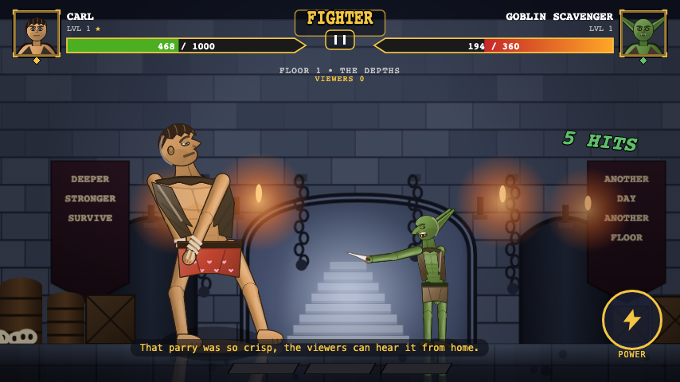
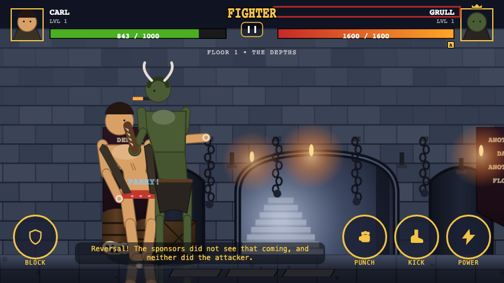
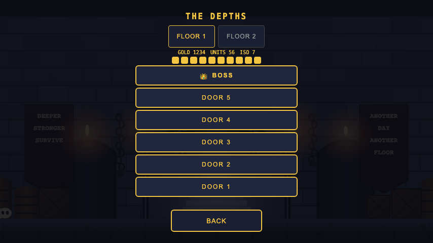
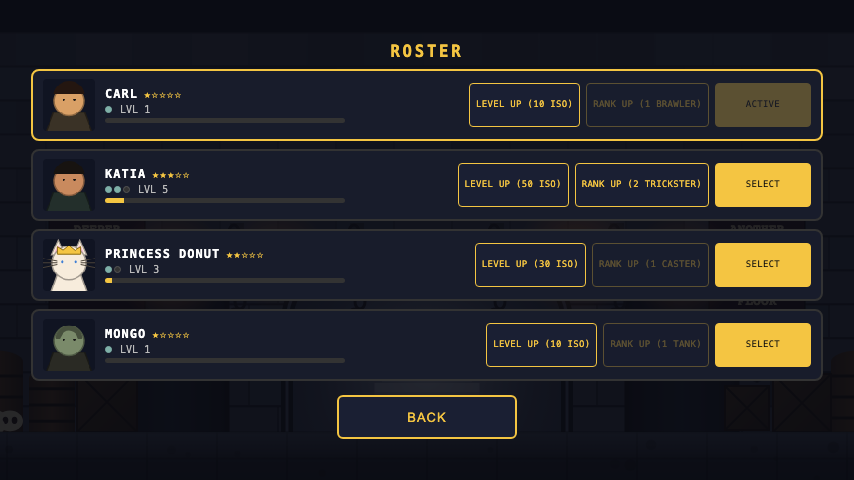

# Carl's Doorway Brawl

One-on-one tap-and-swipe fighter in the Dungeon Crawler Carl universe. Single HTML file, no assets, no build besides `python3 tools/build.py`.

**Play it now:** **[javamomma.github.io/Carls-Arena](https://javamomma.github.io/Carls-Arena/)** — works on a phone (landscape) or a desktop browser, nothing to install.

## Screenshots

| | |
|---|---|
|  |  |
| Floor 1's opening fight | Floor 1's boss door |
|  |  |
| The campaign map | Your roster |

## How to play

Open `index.html` (or the play link above). A fresh save lands straight in the **tutorial** — Floor
0, "THE WAITING ROOM" — a scripted fight against a harmless dummy that walks you through all four
core moves (punch, kick, block/parry, power) one prompt at a time before you can be hurt; finishing
it grants a small gold bonus and opens Floor 1. You can always replay it later from the floor 1 map
(the green TUTORIAL button) or from the title screen's CAMPAIGN button, which starts it automatically
until it's been completed once.

After the tutorial, the title screen offers CAMPAIGN, ARENA, ROSTER, KIOSK, EXHIBITION, and SETTINGS.

- **CAMPAIGN** opens the floor map: a vertical column of doors (five per floor) ending in a **boss
  door**. Doors unlock left-to-right as you clear the one before them; each costs 1 energy (10 max,
  regenerating over time) and pays out gold, ISO, and XP for your active champion on a win, plus
  units and a class catalyst for a boss win. Clearing a floor's boss opens the next floor.
- **ROSTER** shows every champion you own, star rating, rank, and level. LEVEL UP spends ISO,
  RANK UP spends that champion's class catalyst, and SELECT makes a champion the one who actually
  fights doors/arena runs.
- **KIOSK** (the SPONSOR PERK KIOSK) sells crystals with gold or units, plus an ISO pack for gold and
  permanent sponsor perks (small combat buffs, bought once with gold). Opening a crystal from here or
  the CRYSTALS screen grants a new champion or, on a duplicate, star shards toward that champion's
  next star.
- **ARENA** is an endless, energy-free gauntlet: win to raise your streak (tougher every couple of
  wins) and bank gold, or lose and the streak resets. BEST tracks your all-time high streak; the
  local leaderboard ranks your best runs by peak viewers.
- **SETTINGS** toggles reduce motion, haptics (a short vibration when you're hit, on supported
  devices), left-handed controls (mirrors both the on-screen buttons and the touch gesture zones —
  see below), the optional sprite atlas, sound effects, and announcer text.

Every fight tracks **viewers** — a live score built from hits, parries, and specials (style
multipliers for a parry, a 5-hit combo, or landing an S3) that decays while you're being hit. The
result screen shows your PEAK VIEWERS for that fight.

### Controls

**Touch** (landscape phone or tablet): the whole canvas is one big control surface, split into two
gesture zones, plus four on-screen buttons.

- **Defense zone** — the left third of the screen (the right third if LEFT-HANDED CONTROLS is on):
  hold to **BLOCK**, release right before a hit lands to **PARRY** it; swipe away from the offense
  zone to **DASH BACK** (with a moment of invulnerability).
- **Offense zone** — the rest of the screen: tap for a **light** hit, swipe away from the defense
  zone for a **medium**, or hold for ≥180 ms for a charging **heavy** (released on lift).
- **BLOCK** (bottom-left, or bottom-right when left-handed) mirrors the defense zone as a button —
  hold to block.
- **PUNCH** / **KICK** (bottom-right) fire a light / medium on press.
- **POWER** (bottom-right) taps to fire your strongest affordable special; hold it to open a
  picker for S1/S2/S3 specifically, then release over the one you want.

**Keyboard** (desktop browsers, for testing or just preference): `J` light, `K` medium, `A` dash
back, `L` (hold) heavy, `S` (hold) block, `1`/`2`/`3` fire that special, `Space` starts a fight from
the title screen, `P` pauses.

## Development

- Edit files in `src/`, then `python3 tools/build.py` writes `index.html`. Never hand-edit
  `index.html` — it's a generated, concatenated build of every `src/*.js`/`*.html` file.
- `python3 tests/harness.py --unit` runs the in-page unit tests headless (Python Playwright driving
  a real headless Chromium against `index.html`, no npm/node toolchain).
- `python3 tests/harness.py --sim --seconds 60 --bot random --ai basic` soaks the fight loop for a
  fixed number of simulated frames, restarting on every KO.
- `python3 tests/harness.py --matrix` runs the full AI/content soak matrix (every rig × mob × AI
  tier × seed combination); `python3 tests/harness.py --perf 600` gates ms/frame under 6 ms.
- `python3 tests/harness.py --e2e --seed 1` runs the full crystals → roster → quest → rewards →
  level-up → arena loop headless; add `--loops 20` for a longer menu+fight soak.
- `python3 tests/harness.py --tutorial --seed 1` plays the Floor 0 tutorial headless via a scripted
  bot and asserts every prompt fires in order.
- `python3 tests/harness.py --share --shot /tmp/share.png` checks `G.shareCard()`'s PNG data URL.
- `python3 tests/harness.py --screens-smoke` visits every screen plus one real fight and checks for
  page/console errors on each; `python3 tests/harness.py --phone-check` asserts the canvas stays
  letterboxed, on-screen buttons are real ≥44px touch targets, and the page never scrolls
  horizontally at an 844×390 CSS-px landscape-phone viewport.
- `python3 tests/harness.py --screen <name> --shot out.png` screenshots any menu screen
  (`title|map|roster|crystal|shop|arena|settings`) without starting a fight; `--pose <key> --shot
  out.png` freezes a fighter in a named rig pose for a clean reference shot.
- `python3 tests/batch.py --n 30 --ai t1,t2,t3,t4,t5` runs the seeded win-rate table against
  `Ctrl.competent` across the AI difficulty tiers (and, by default, every floor node/boss), gating on
  a monotone non-increasing curve.
- `tools/shots.sh` regenerates every `docs/shots/*.png` in one command.
- Release rubric (every exit criterion, verified): `docs/ARENA.md`.
- Plan: `docs/superpowers/plans/2026-09-21-carls-arena-fighter.md`.

## Adding your own art

Every fighter is drawn by a stylized vector rig by default — no image assets ship with the game,
and nothing is fetched over the network unless you turn this on. If you'd rather draw a character
by hand, you can drop in a sprite sheet per look; it replaces the rig for that character only,
pose by pose, falling back to the rig for any pose the sheet doesn't cover.

**Enable it** with Settings → USE SPRITE ATLAS, or by loading the page with `?atlas=1` in the URL.
Off (the default), the game never fetches anything — this is a purely optional, offline-friendly
feature.

**Folder layout**, one folder per look id (the same ids the roster/encounters use — `carl`,
`katia`, `goblin`, `hobgoblin`, `donut`, `skeleton`, `shaman`, `grub`, `mongo`, `grull`,
`mother_rat`):

```
assets/
  carl/
    sheet.png   # one sprite sheet, any grid layout you like
    sheet.json  # the manifest below
  donut/
    sheet.png
    sheet.json
```

A look with no folder, no `sheet.json`, or a `sheet.png` that fails to load just draws the rig —
silently, with no error and no console noise, at the exact frame it would've drawn anyway.

**Manifest** (`sheet.json`):

```json
{
  "frame": {"w": 96, "h": 128, "anchorX": 48, "anchorY": 120},
  "poses": {
    "idle": [[0, 0], [96, 0]],
    "light1": [[0, 128], [96, 128], [192, 128]]
  }
}
```

- `frame` is the pixel size every frame in the sheet shares, plus the **anchor**: the point inside
  each frame — in frame-local pixels, from its top-left corner — that lands on the character's own
  feet on the floor. Get this wrong and the sprite floats above or sinks below the floor line.
- `poses` maps a pose key to a list of `[x, y]` frame origins (the top-left corner of that frame
  within `sheet.png`). You don't need every pose — cover as many or as few as you like; anything
  missing draws the vector rig instead. The keys the game can ever ask for are: `idle`, `walk`,
  `dash`, `light1`–`light5`, `medium`, `heavyCharge`, `heavy`, `block`, `blockstun`, `hit`,
  `knockdown`, `getup`, `stunned`, `s1`, `s2`, `s3`, `win`, `ko`.
- Each pose's frame list is sampled across the move's whole duration (frame 0 at the pose's start,
  the last frame at its end) — a 2-frame `idle` alternates back and forth, a 3-frame `light1`
  plays start → peak → recovery once, in order.
- The sprite is mirrored automatically when the fighter faces left, and scaled by that character's
  own `def.scale` — draw the sheet at its natural size, facing right.

Contact shadows and the floor reflection still draw under/behind a sprite exactly as they do for
the rig — nothing else about a fight changes.

## Credits

A fan project, built for fun and not for profit. *Dungeon Crawler Carl* is Matt Dinniman's — this
game borrows its tone and setting as an homage and isn't affiliated with or endorsed by him or his
publisher. All code, art, and writing here are original.
